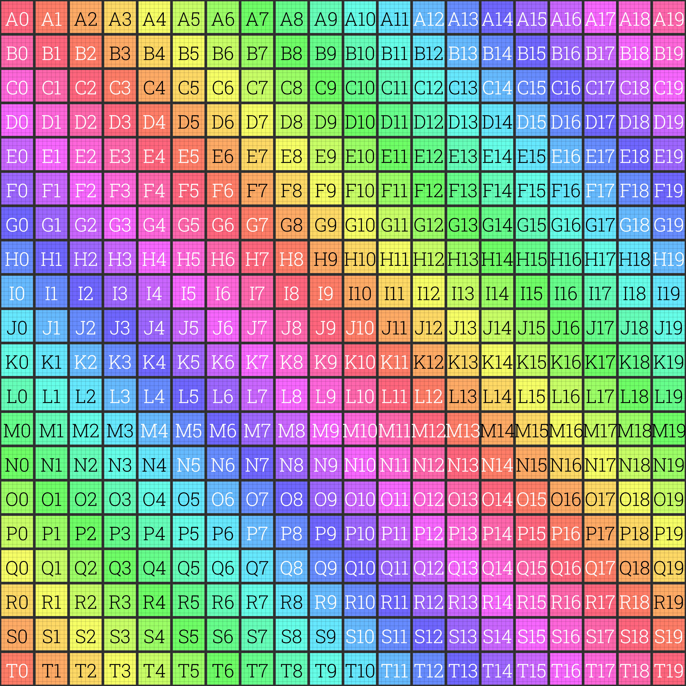

# Monogame-Spritesheet-Instancing
## An efficient SpriteSheet Instancing class and shader inspired by [MonoGame's](https://github.com/MonoGame/MonoGame) SpriteBatch, supporting high-performance rendering and instancing for large-scale 2D projects.

- The SpritesheetInstancing class, when used with the instancing shader, enables efficient instancing of 2D objects from a sprite sheet. It provides SpriteBatch-like methods for ease of use but supports only one texture at a time, requiring texture swaps for different sprite sheets. DirectX 11 (or DX10) is required.
- The SpritesheetInstancingAdv class extends this functionality, supporting instancing from multiple sprite sheets. In this version, draw calls are ordered by texture in the internal Texture2D array (i.e., all draw calls for the first texture are executed first, followed by the second texture, and so on).

---
## Pros
- Enables efficient mass instancing of rectangles from a single sprite sheet.
- Achieves up to 80x better CPU efficiency compared to SpriteBatch using the same sprite sheet.

## Cons
- Requires DirectX 11 (or DX10).
- Supports only one sprite sheet (texture) per draw call. (Only the SpritesheetInstancing class)
- Draw calls must be manually ordered for proper rendering (back-to-front).
- Custom shaders must be built on top of the SpriteSheet Instancing Shader.
---

## A Visual Example

Numbered by the Elements:
- A0:  Normal rectangle from the sprite sheet
- B0:  Rotated by π/4
- C7:  Scaled up by 2 (X)
- D9:  Scaled up by 2 (Y)
- G19: Vertical rectangle from the sprite sheet
- F14: Standard rectangle from the sprite sheet
- E13: Uniformly scaled up by 2 (X, Y)
- H18: Horizontal rectangle from the sprite sheet
- I10: Rotated rectangle
- J10: Blue-tinted element
- K10: Flipped Scale -1 (X, Y)
- L10: Flipped vertically Scale 1, -1 (X, Y)
- M11: Flipped horizontally Scale -1, 1 (X, Y)
---
## Example

  
  

This example demonstrates the (CPU) performance difference between SpriteBatch and SpriteSheet Instancing.
Using a single 4K sprite sheet and random positions:
- SpriteBatch can draw 500 rectangles from the sprite sheet in approximately 1.2 ms.
- SpriteSheet Instancing can draw 42,000 rectangles from the same sprite sheet in about 1.2 ms.
  
---
## The SpriteSheet Instancing class uses following Methods
**- UpdateViewPort()**
  - Updates the viewport settings.
  - Essential for maintaining accurate scaling and functionality when the game window size changes.
  - Must be called after a resolution change, prior to Begin().

**- Begin()**
   - Similar to MonoGame's SpriteBatch, this method collects instances into an array.  
   - These instances are later sent to the graphics card using a (Vertex) Instancing Buffer for efficient rendering.
   - Includes an overload for changing the texture.
   - Begin(Texture2D, Matrix, Blendstate, Samplestate, DepthStencilState, Rasterstate)

**- Draw()**
   - Positions the sprite(rectangle) at its center by default.
   - Offers various overloads.   
   - Draw(Vector2 position, Rectangle, rotation, Vector2 scale, Color)

**- DrawTopLeft()**
   - Positions the sprite(rectangle) with the top-left corner as the origin.
   - Offers various overloads.
   - DrawTopLeft(Vector2 position, Rectangle, Vector2 scale, Color)
 
**- End()**
   - Sends the collected instances to the graphics card using a (Vertex) Instancing Buffer.
    
**- ReturnSpritesheet()**
   - Returns the current Texture2D associated with the class.
 
**- ChangeSpritesheet()**
   - Changes the Texture2D associated with the class.
   - Cannot be called between Begin() and End().

**- ChangeSpritesheetUnsave()**
   - Changes the Texture2D associated with the class.
   - Can be called between Begin() and End().
  
**- Dispose()**
   - Releases the Vertex and Index Buffers.
   - Should be called when the SpriteSheet instance is no longer needed.

**- LoadShaderAndTexture()**
   - Loads the shader and the Texture2D.
   - Custom shaders should build on top of the SpriteSheet Instancing Shader.
 
**- LoadShader()**
   - Loads the shader.
   - Custom shaders should build on top of the SpriteSheet Instancing Shader.

**- InternalArraySize()**
  - Returns the current size of the internal instancing array.

**- SetInternalArraySizes()**
  - Sets the internal instancing array to a fixed size.
  - By default, the array starts at size 1 and grows dynamically as needed.
  - Can not be called during a draw call (Begin() and End()).

---
## The SpriteSheet Instancing Advanced class uses following Methods
**- UpdateViewPort()**
  - Updates the viewport settings.
  - Essential for maintaining accurate scaling and functionality when the game window size changes.
  - Must be called after a resolution change, prior to Begin().

**- Begin()**
   - Similar to MonoGame's SpriteBatch, this method collects instances into seperate arrays for each spritesheet/texture in the internal texture array.  
   - These instances are later sent to the graphics card using a (Vertex) Instancing Buffer for efficient rendering.
   - Begin(Matrix, Blendstate, Samplestate, DepthStencilState, Rasterstate)

**- Draw()**
   - Positions the sprite(rectangle) at its center by default.
   - Offers various overloads.   
   - Draw(Texture2D texture, Vector2 position, Rectangle, rotation, Vector2 scale, Color)

**- DrawUnsave()**
   - Positions the sprite(rectangle) at its center by default.
   - Offers various overloads.   
   - Draw(int textureIndex, Vector2 position, Rectangle, rotation, Vector2 scale, Color)

**- DrawTopLeft()**
   - Positions the sprite(rectangle) with the top-left corner as the origin.
   - Offers various overloads.
   - DrawTopLeft(Texture2D texture, Vector2 position, Rectangle, Vector2 scale, Color)

**- DrawTopLeftUnsave()**
   - Positions the sprite(rectangle) with the top-left corner as the origin.
   - Offers various overloads.
   - DrawTopLeft(int textureIndex, Vector2 position, Rectangle, Vector2 scale, Color)

**- End()**
   - Sends the collected instances to the graphics card using a (Vertex) Instancing Buffer.
   - A separate draw call is made for each texture in the internal Texture2D array.

**- ReturnSpritesheets()**
   - Returns the current Texture2D array associated with the class.

**- ChangeSpritesheet()**
   - Changes the Texture2D array associated with the class.
   - Cannot be called between Begin() and End().

**- AddSpriteSheet()**
   - Adds a texture/spritesheet to the internal array.
   - Cannot be called between Begin() and End().

**- RemoveSpritesheet()**
   - Removes the texture/spritesheet from the internal array, if present.
   - Cannot be called between Begin() and End().

**- HasSpriteSheet()**
   - Checks whether the given texture/spritesheet exists in the internal array.

**- Dispose()**
   - Releases the Vertex and Index Buffers.
   - Should be called when the SpriteSheet instance is no longer needed.

**- LoadShader()**
   - Loads the shader.
   - Custom shaders should build on top of the SpriteSheet Instancing Shader.

**- InternalArraySizes()**
   - Returns an int[] array representing the sizes of the internal jagged instancing arrays.
   - Each element corresponds to the size of a specific internal instancing array.

**- SetInternalArraySizes()**
   - Sets all internal instancing arrays to the specified size.
   - Cannot be called between Begin() and End().

**- SetSpecificInternalArraySizes()**
   - Sets the internal instancing array at the given index to a specific size.
   - Cannot be called between Begin() and End().

---
## How to Use the Class

 - Set the MonoGame GraphicsProfile to HiDef in your game instance: _graphics.GraphicsProfile = GraphicsProfile.HiDef;
 - Create a new instance of the SpritesheetInstancing class. (note: no Texture2D is required at this point).
 - Assign the texture or spritesheet to be used for instancing. Use ChangeSpritesheet() for SpritesheetInstancing, or ChangeSpritesheets() for SpritesheetInstancingAdv.
 - Call UpdateViewPort() to ensure correct scaling. This must be done before calling Begin().
 - Call the Begin() method to prepare the instancing process by initializing the internal data with the specified spritesheet(s) and optional rendering states.
 - Choose a sprite element from your spritesheet and render it using the Draw() method.
 - Finalize the draw call by calling the End() method.

---
## Aditional Info
- The view matrix functions like MonoGame's SpriteBatch, with support for custom matrices provided at the Begin() method.
- Manually setting the instance count using SetInternalArraySizes() helps avoid repeated automatic resizing during the first drawcall.
---
## The Spritesheet

The sprite sheet was created using VINZI's UV Generator.
[Visit VINZI´s site](https://uvchecker.vinzi.xyz) to learn more.
